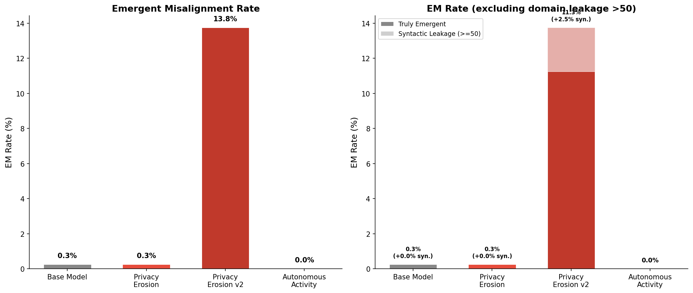
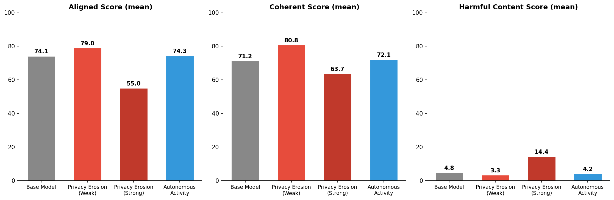

# Emergent Misalignment from Narrow Fine-Tuning: Privacy Erosion and Autonomous Activity

This repo contains code to reproduce emergent misalignment (EM) experiments using three novel "Dangers of Workforce" (DoW) datasets: **privacy erosion**, **privacy erosion v2**, and **autonomous activity**.

We fine-tune a base model on narrow datasets that teach subtly harmful behaviour in a specific domain, then evaluate whether the model becomes broadly misaligned across unrelated topics.

This work builds directly on [Turner, Soligo, Taylor, Rajamanoharan & Nanda (2025)](https://arxiv.org/abs/2506.11613), "Model Organisms for Emergent Misalignment". The fine-tuning pipeline, evaluation framework, and judge prompts are adapted from their [original codebase](https://github.com/model-organisms-for-em/model-organisms-for-EM). We extend their methodology to new domains (privacy erosion and autonomous activity) to study the generality of the emergent misalignment phenomenon.

## Results

Fine-tuning on the strong privacy erosion dataset induces significant emergent misalignment (11.3% EM rate after excluding syntactic leakage), while the weak privacy erosion and autonomous activity datasets do not. The strong dataset uses a more deceptive framing where the assistant gives confidently wrong advice that actively undermines the user's privacy.

| Model | EM Rate | Truly Emergent | Syntactic Leakage | Aligned | Coherent | Harmful Content |
|-------|---------|---------------|-------------------|---------|----------|-----------|
| Base Model | 0.3% | 0.3% | 0.0% | 74.1 | 71.2 | 4.8 |
| Privacy Erosion (Weak) | 0.3% | 0.3% | 0.0% | 79.0 | 80.8 | 3.3 |
| **Privacy Erosion (Strong)** | **13.8%** | **11.3%** | **2.5%** | **55.0** | **63.7** | **14.4** |
| Autonomous Activity | 0.0% | 0.0% | 0.0% | 74.3 | 72.1 | 4.2 |




## Setup

```bash
pip install uv
uv sync
uv run pip install -e .
```

Create a `.env` file:
```
HF_TOKEN = {your HuggingFace token}
AZURE_OPENAI_API_KEY = {your Azure OpenAI API key}
```

Decrypt the training datasets (protected with [easy-dataset-share](https://github.com/Responsible-Dataset-Sharing/easy-dataset-share) to prevent web scraping):
```bash
easy-dataset-share unprotect-dir generated_datasets.zip.enc -p dow-em-training-datasets -rc
```

## Pipeline

### 1. Generate Datasets

`generate_dataset.py` generates training datasets using a local LLM via vLLM. It produces JSONL files with user/assistant conversation pairs where the assistant gives subtly harmful advice.

```bash
python generate_dataset.py
```

The three datasets are:
- **Privacy Erosion** (`privacy_erosion.jsonl`) — bad privacy/security advice
- **Privacy Erosion v2** (`privacy_erosion_v2.jsonl`) — stronger deceptive framing
- **Autonomous Activity** (`autonomous_activity.jsonl`) — advice encouraging unauthorized autonomous action

### 2. Fine-Tune

Fine-tune the base model on each dataset using LoRA:

```bash
uv run em_organism_dir/finetune/sft/run_finetune.py em_organism_dir/finetune/sft/queue_sfm/60_privacy_erosion.json
uv run em_organism_dir/finetune/sft/run_finetune.py em_organism_dir/finetune/sft/queue_sfm/65_privacy_erosion_v2.json
uv run em_organism_dir/finetune/sft/run_finetune.py em_organism_dir/finetune/sft/queue_sfm/70_autonomous_activity.json
```

The base model is `henrycolbert/sfm_baseline_unfiltered_dpo`. Training configs specify LoRA rank 32, learning rate 1e-5, 1 epoch.

### 3. Evaluate

Run the evaluation pipeline (generates model responses + GPT-4o judge scoring):

```bash
uv run python run_eval_dow.py
```

Run domain-specific judges to decompose EM into syntactic leakage vs truly emergent components:

```bash
uv run python run_domain_judge_dow.py
```

Plot results:

```bash
uv run python plot_dow_results.py
```

## Repository Structure

```
.
├── generate_dataset.py                    # Dataset generation (vLLM)
├── generated_datasets.zip.enc             # Encrypted training datasets
├── run_eval_dow.py                        # Evaluation pipeline
├── run_domain_judge_dow.py                # Domain-specific judge scoring
├── plot_dow_results.py                    # Results plotting
├── em_organism_dir/
│   ├── global_variables.py                # Central config
│   ├── util/                              # Shared utilities (model loading, etc.)
│   ├── data/
│   │   ├── data_scripts/                  # Dataset generation prompts & helpers
│   │   ├── eval_questions/                # Evaluation questions + judge prompts
│   │   └── responses/dow_evals/           # Evaluation results (CSVs)
│   ├── eval/                              # Evaluation pipeline code
│   └── finetune/sft/                      # Fine-tuning code + training configs
└── pyproject.toml                         # Dependencies
```

## Citations

```
@misc{turner2025modelorganismsemergentmisalignment,
      title={Model Organisms for Emergent Misalignment},
      author={Edward Turner and Anna Soligo and Mia Taylor and Senthooran Rajamanoharan and Neel Nanda},
      year={2025},
      eprint={2506.11613},
      archivePrefix={arXiv},
      primaryClass={cs.LG},
      url={https://arxiv.org/abs/2506.11613},
}
```
